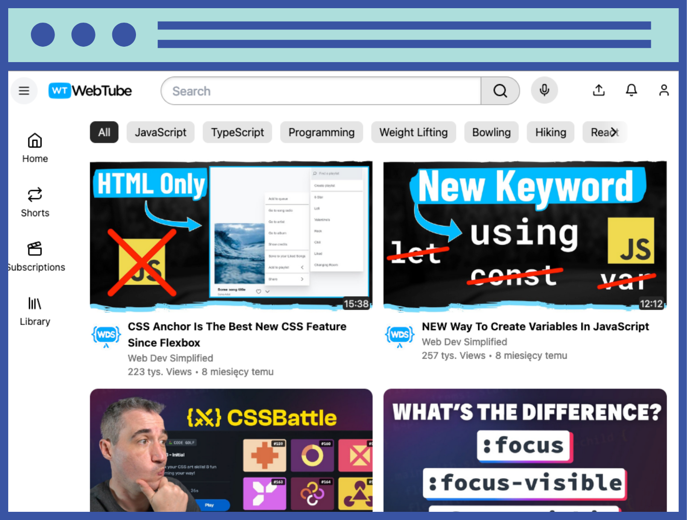

# WebTube project documentation

## 1. Introduction

The WeTube project is a clone of the front-end layer of the YouTube platform. It is a fully responsive application designed and implemented using TypeScript and React. The project was created using Vite for rapid building and running of the application.

Live version of the project: [WeTube Live](https://wetube-pan-be.netlify.app/)
## 2. Technologies

Technologies used in the project:

    TypeScript
    [React](https://reactjs.org/)
    Vite

## 3. Project Structure

wetube/ 
│ 
├── public/ 
│   └── ... 
│ 
├── src/ 
│   ├── components/ 
│   │   ├── Header.tsx 
│   │   ├── VideoPlayer.tsx 
│   │   └── ... 
│   ├── pages/ 
│   │   ├── Home.tsx 
│   │   ├── Watch.tsx 
│   │   └── ... 
│   ├── services/ 
│   │   ├── api.ts 
│   │   └── ... 
│   ├── styles/ 
│   │   ├── global.css 
│   │   └── ... 
│   ├── App.tsx 
│   ├── main.tsx 
│   └── ... 
│ 
├── .gitignore 
├── package.json 
└── ... 

Description of the structure:

    public/: Contains public files such as index.html.
    src/: Main source directory.
        components/: React components.
        pages/: Application pages.
        services/: Services to handle external API.
        styles/: Style sheets.
        App.tsx: Main application component.
        index.tsx: Entry file.
    .gitignore: List of files and directories ignored by Git.
    package.json: npm configuration file.

## 4. Installation and Running

To install the project locally, follow these steps:

    Clone the repository:
    git clone https://github.com/Pan-be/wetube.git

    Navigate to the project directory:
    cd wetube

    Install dependencies:
    npm install
   
    Run the project:
    npm run dev
The application will be running at http://localhost:3000.

## 5. Features

    Browse list of videos.
    Playback of selected video.
    Search for videos.
    Preview video thumbnails.
    Full responsiveness.

## 6. Summary

The WeTube project is a clone of the front-end layer of the YouTube platform, implemented using TypeScript and React. It is fully responsive and allows browsing and playback of videos. The project has been optimized using Vite, ensuring fast performance of the application.
   
## Author

[pan.be](https://business-card-pan-be.netlify.app)
